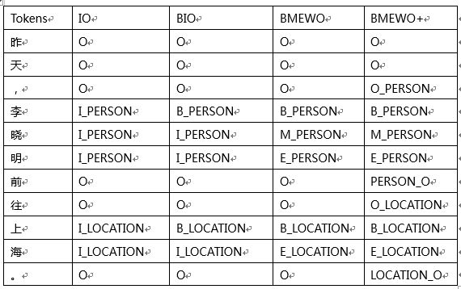
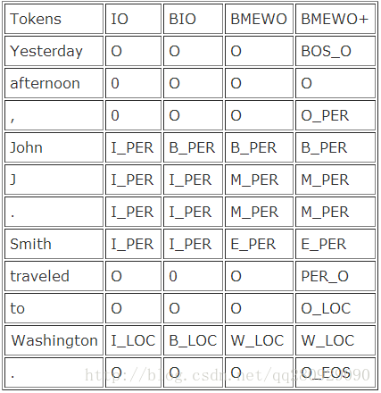

# DJH-Chunking-Encoding-Algorithm
Coding Chunkers as Taggers: IO, BIO, BMEWO, and BMEWO+

---
#### Environment
python 2.7

#### Tag System

Reference：
https://lingpipe-blog.com/2009/10/14/coding-chunkers-as-taggers-io-bio-bmewo-and-bmewo/
https://www.cnblogs.com/qniguoym/p/7998343.html
#### Directory
- util
	- io.py
	- peopledaily.py
- corpora
	-peopledaily
- images
- IO
- BIO
- BMEWO
- BMEWO+
- README.md
- corpus_Pretreatment.py

- 使用方法
1.首先对语料数据预处理（如果已经满足序列标注的要求，可以不用预处理），注意：如果使用原始文本，需要先做分词和词性标注处理，然后再预处理
2.确定标签体系，使用该标签体系给数据打标签
3.这里主要给常见实体打标签：时间、姓名、地址、组织

+ 注意
在人民日报语料库中199801.txt，有几个标记特殊：腾空而起/l/%，次/q/m，需要注意
crf++对数据格式要求：tab分割
测评工具conlleval.pl 对数据格式要求：空格分割，比较后两列